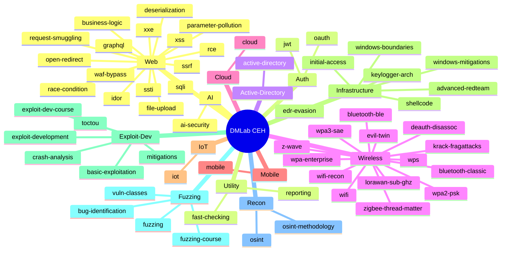

# DMLab CEH — Mindmap Skill Library

Peta visual 58 skill, per kategori. Gunakan untuk navigasi, menemukan skill yang belum dikenal, dan spot coverage gap sebelum engagement.

Referensi kelengkapan: [MITRE ATT&CK](https://attack.mitre.org/), [HackTricks](https://book.hacktricks.xyz/), [OWASP WSTG](https://owasp.org/www-project-web-security-testing-guide/), [PayloadsAllTheThings](https://github.com/swisskyrepo/PayloadsAllTheThings).

---

## Peta Library

---

## Coverage Cross-Reference

Semua skill hidup di `skills/<nama-skill>/SKILL.md` (flat, tanpa kategori di path). Tabel pakai notasi `skills/offensive-<nama>`.

### Web Application (OWASP WSTG)

| Surface | Skill |
|---|---|
| Information gathering | `skills/offensive-osint`, `skills/offensive-osint-methodology` |
| Configuration / deployment | `skills/offensive-waf-bypass` |
| Identity management | `skills/offensive-jwt`, `skills/offensive-oauth` |
| Authentication | _(dalam scope `offensive-business-logic`)_ |
| Authorization | `skills/offensive-idor` |
| Session management | `skills/offensive-jwt`, `skills/offensive-oauth` |
| Input validation | `skills/offensive-sqli`, `skills/offensive-xss`, `skills/offensive-xxe`, `skills/offensive-ssti`, `skills/offensive-ssrf` |
| Error handling | _(implicit across web skills)_ |
| Cryptography | _(planned)_ |
| Business logic | `skills/offensive-business-logic` |
| Client-side | `skills/offensive-xss`, `skills/offensive-open-redirect` |
| API testing | `skills/offensive-graphql` |

### Internal Network / Active Directory (MITRE ATT&CK Enterprise)

| Tactic | Skill |
|---|---|
| Reconnaissance | `skills/offensive-osint`, `skills/offensive-active-directory` |
| Initial Access | `skills/offensive-initial-access` |
| Execution | `skills/offensive-advanced-redteam` |
| Persistence | `skills/offensive-active-directory` |
| Privilege Escalation | `skills/offensive-active-directory` |
| Defense Evasion | `skills/offensive-edr-evasion`, `skills/offensive-windows-mitigations`, `skills/offensive-windows-boundaries` |
| Credential Access | `skills/offensive-active-directory` |
| Discovery | `skills/offensive-osint`, `skills/offensive-active-directory` |
| Lateral Movement | `skills/offensive-active-directory`, `skills/offensive-advanced-redteam` |
| Collection | `skills/offensive-advanced-redteam` |
| Command and Control | `skills/offensive-advanced-redteam` |
| Exfiltration | `skills/offensive-advanced-redteam` |
| Impact | `skills/offensive-advanced-redteam` |

### Wireless

| Surface | Skill |
|---|---|
| Recon / war-driving | `skills/offensive-wifi-recon` |
| WPA2-PSK | `skills/offensive-wpa2-psk`, `skills/offensive-wifi` |
| WPA3-SAE | `skills/offensive-wpa3-sae`, `skills/offensive-wifi` |
| WPA-Enterprise | `skills/offensive-wpa-enterprise`, `skills/offensive-wifi` |
| WPS | `skills/offensive-wps`, `skills/offensive-wifi` |
| Evil twin / KARMA / Mana | `skills/offensive-evil-twin`, `skills/offensive-wifi` |
| KRACK / FragAttacks | `skills/offensive-krack-fragattacks` |
| Deauth / Disassoc | `skills/offensive-deauth-disassoc` |
| Bluetooth BLE | `skills/offensive-bluetooth-ble` |
| Bluetooth Classic | `skills/offensive-bluetooth-classic` |
| Zigbee / Thread / Matter | `skills/offensive-zigbee-thread-matter` |
| Z-Wave | `skills/offensive-z-wave` |
| LoRa / sub-GHz | `skills/offensive-lorawan-sub-ghz` |

### Cloud

| Provider / Surface | Skill |
|---|---|
| AWS — privesc, IMDS, persistence | `skills/offensive-cloud` |
| Azure — privesc, IMDS, persistence | `skills/offensive-cloud` |
| GCP — privesc, IMDS, persistence | `skills/offensive-cloud` |
| Cross-cloud / OIDC trust | `skills/offensive-cloud` |
| Hybrid identity (AAD Connect, ADFS) | _(planned)_ |

### Mobile

| Platform / Surface | Skill |
|---|---|
| Android static + dynamic | `skills/offensive-mobile` |
| iOS static + dynamic | `skills/offensive-mobile` |
| Firebase / cloud misconfig | `skills/offensive-mobile` |
| Mobile API testing | `skills/offensive-mobile` |
| Biometric / pinning bypass | `skills/offensive-mobile` |

### IoT / Embedded

| Layer | Skill |
|---|---|
| Hardware recon | `skills/offensive-iot` |
| UART / JTAG / SWD | `skills/offensive-iot` |
| Flash extraction | `skills/offensive-iot` |
| Firmware analysis | `skills/offensive-iot` |
| Bootloader / secure boot | `skills/offensive-iot` |
| RTOS exploitation | `skills/offensive-iot` |
| ICS / OT protocols | `skills/offensive-iot` |
| MQTT / CoAP | `skills/offensive-iot` |

### Exploit Development

| Topic | Skill |
|---|---|
| Beginner / mitigations off | `skills/offensive-basic-exploitation` |
| Course curriculum | `skills/offensive-exploit-dev-course` |
| Stack / heap / ROP | `skills/offensive-exploit-development` |
| Modern mitigations | `skills/offensive-mitigations` |
| Crash triage | `skills/offensive-crash-analysis` |
| TOCTOU / race | `skills/offensive-toctou`, `skills/offensive-race-condition` |

### Fuzzing & Vulnerability Research

| Topic | Skill |
|---|---|
| Coverage-guided fuzzing | `skills/offensive-fuzzing` |
| Fuzzing curriculum | `skills/offensive-fuzzing-course` |
| Static review patterns | `skills/offensive-bug-identification` |
| Vuln class taxonomy | `skills/offensive-vuln-classes` |

### AI Security

| Topic | Skill |
|---|---|
| Prompt injection / jailbreak / RAG | `skills/offensive-ai-security` |

### Utility

| Topic | Skill |
|---|---|
| Fast triage checklist | `skills/offensive-fast-checking` |
| Pro pentest reporting | `skills/offensive-reporting` |

---

## Cara Pakai Mindmap

- **Pre-engagement:** Telusuri cabang kategori yang relevan dan pastikan satu skill ada per permukaan dalam scope. Gap yang terlihat di sini = gap di rencana engagement.
- **Saat engagement:** Masuk kategori untuk permukaan yang diuji; load hanya skill itu ke agent.
- **Post-engagement:** Cross-check temuan terhadap cabang mindmap untuk memastikan tidak ada permukaan yang terlewat.
