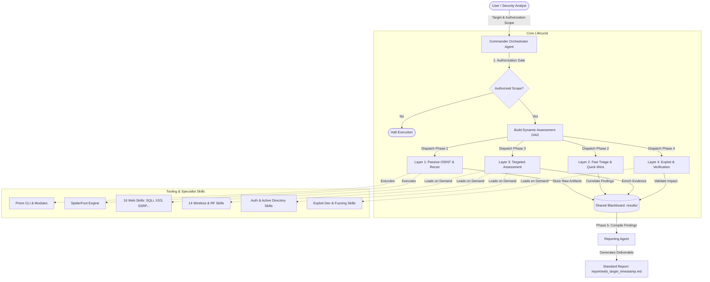

# DMLab CEH — Agentic Multi-Agent Ethical Hacking & OSINT Framework

<p align="center">
  
  
  
  
  
  
</p>

---

## 📌 Executive Overview

**DMLab CEH** is an open, modular, and agent-agnostic **Ethical Hacking & OSINT framework** built to bridge the gap between autonomous AI coding agents and real-world penetration testing methodologies. 

By orchestrating **58 standardized offensive security skills** (structured in YAML frontmatter `SKILL.md` format) alongside battle-tested OSINT engines ([**Prism**](tools/prism) and [**SpiderFoot**](tools/spiderfoot)), DMLab CEH enables an AI **Commander Agent** to dynamically plan, dispatch specialized agents, correlate vulnerabilities across a shared blackboard, and generate audit-ready CVSS v3.1/v4.0 deliverables.

> [!IMPORTANT]
> **Authorization & Compliance Notice**  
> This project is designed strictly for **educational research, authorized red teaming, and lawful penetration testing** within explicitly defined scopes (private labs, CTFs, and documented Bug Bounty/client engagements). **No authorization → strictly no execution.**

---

## 🏗️ Architecture & Multi-Agent Lifecycle

The framework follows a decoupled **Orchestrator-Specialist** design where the Commander manages workflow states while specialist agents load granular attack-surface skills on demand.



---

## 📂 Repository Structure

```
dmlab.ceh/
├── docs/                      # Central technical documentation & guides
│   ├── AGENTS.md              # Multi-Agent Architecture & Specialist Schema
│   ├── WORKFLOW.md            # End-to-End 8-Phase Pentesting Lifecycle
│   ├── ONBOARDING.md          # Step-by-Step Installation & Setup Guide
│   ├── MINDMAP.md             # 58 Skills Catalog & OWASP/MITRE Cross-Matrix
│   ├── PROJECT-MANAGEMENT.md  # Engagement Management & Evidence Hygiene
│   └── IDEA.md                # Framework Technical Vision & Roadmap
├── skills/                    # 58 Standardized Offensive Skills (Source of Truth)
│   ├── offensive-sqli/SKILL.md
│   ├── offensive-xss/SKILL.md
│   ├── offensive-active-directory/SKILL.md
│   └── ...                    # (13 specialized attack surface categories)
├── tools/
│   ├── prism/                 # Self-hosted OSINT & Reconnaissance Engine (Submodule)
│   ├── spiderfoot/            # Automated Footprinting & Intelligence Gathering (Submodule)
│   └── src/                   # Universal installer & utility scripts
│       ├── install_skills.py  # Universal Python installer (Windows/Linux/macOS)
│       └── install_skills.sh  # POSIX Shell installer wrapper
├── template/                  # Standardized audit reporting templates (TEMPLATE.md)
├── report/                    # Generated engagement reports (Gitignored)
├── results/                   # Shared findings blackboard & evidence (Gitignored)
├── .agents/                   # Local workspace skills installation directory (Gitignored)
├── .venv/                     # Project-isolated Python virtual environment (Gitignored)
├── requirements.txt           # Unified dependency manifest for all tools
├── .gitattributes             # GitHub Linguist overrides & line ending policies
├── README.md                  # Project overview, quick start & reference guide
├── SECURITY.md                # Vulnerability disclosure policy
├── CONTRIBUTING.md            # Community contribution guidelines
└── CHANGELOG.md               # Version history and release notes
```

---

## ⚡ Quick Start & Installation

DMLab CEH is **100% cross-platform** (Windows, Linux, macOS) and maintains strict runtime isolation: all dependencies and installed skills reside locally in the project without altering your global machine environment.

### Step 1: Clone Repository with Submodules

```bash
git clone --recurse-submodules https://github.com/digimetalab/dmlab.ceh.git
cd dmlab.ceh
```

*(If cloned without `--recurse-submodules`, initialize them with: `git submodule update --init --recursive`)*

### One-Command Automated Setup (Recommended)

Run the root installer to automatically initialize submodules, create `.venv`, install all Python libraries, and deploy the 58 skills:

```bash
# Universal (Windows, Linux, macOS):
python install.py

# Linux / macOS / POSIX Shell:
./install.sh
```

---

### Step-by-Step Manual Setup

If you prefer manual, granular control:

```bash
# 1. Initialize Git Submodules
git submodule update --init --recursive

# 2. Create Virtual Environment & Install Dependencies
python -m venv .venv
# Linux/macOS: source .venv/bin/activate
# Windows:     .venv\Scripts\Activate.ps1
pip install -r requirements.txt

# 3. Install 58 Skills to .agents/skills/
python tools/src/install_skills.py
```

---

## 🎯 58 Standardized Skills Catalog

The skill catalog provides specialized knowledge modules formatted for direct AI ingestion:

| Domain | Count | Covered Skills |
|---|:---:|---|
| **Web Applications** | 16 | `sqli`, `xss`, `ssrf`, `ssti`, `xxe`, `idor`, `file-upload`, `rce`, `deserialization`, `race-condition`, `request-smuggling`, `open-redirect`, `parameter-pollution`, `graphql`, `waf-bypass`, `business-logic` |
| **Authentication & IAM** | 2 | `jwt`, `oauth` |
| **Active Directory** | 1 | `active-directory` (Kerberoasting, AS-REP Roasting, ACL Abuse, ADCS, Lateral Movement) |
| **Wireless & RF** | 14 | `wifi`, `wifi-recon`, `wpa2-psk`, `wpa3-sae`, `wpa-enterprise`, `wps`, `evil-twin`, `krack-fragattacks`, `deauth-disassoc`, `bluetooth-ble`, `bluetooth-classic`, `zigbee-thread-matter`, `z-wave`, `lorawan-sub-ghz` |
| **Cloud Security** | 1 | `cloud` (AWS, Azure, GCP IAM escalation, IMDS, exfiltration) |
| **Mobile Security** | 1 | `mobile` (Android & iOS static/dynamic analysis, Frida, IPC redirection) |
| **IoT & Hardware** | 1 | `iot` (Firmware analysis, UART/JTAG, hardware protocols) |
| **Infrastructure & Red Team** | 7 | `initial-access`, `advanced-redteam`, `edr-evasion`, `shellcode`, `keylogger-arch`, `windows-mitigations`, `windows-boundaries` |
| **Exploit Development** | 6 | `exploit-development`, `exploit-dev-course`, `basic-exploitation`, `crash-analysis`, `mitigations`, `toctou` |
| **Fuzzing & Vulnerability Research** | 4 | `fuzzing`, `fuzzing-course`, `bug-identification`, `vuln-classes` |
| **OSINT & Intelligence** | 2 | `osint`, `osint-methodology` |
| **AI Security** | 1 | `ai-security` (Prompt injection, jailbreaking, model extraction) |
| **Core Utilities** | 2 | `fast-checking`, `reporting` (CVSS v3.1/v4.0 scoring, evidence hygiene) |

👉 *For detailed descriptions, MITRE ATT&CK references, and OWASP Top 10 mappings, review [MINDMAP.md](docs/MINDMAP.md).*

---

## 🛠️ Tooling & Footprinting Workflows (Full CLI Mode)

All tools operate natively within the local `.venv` environment and feature rich CLI capabilities:

```bash
# 1. Prism OSINT Platform CLI (Domain, Email, IP, Telegram, Username, Watchlists)
cd tools/prism
python cli.py scan example.com --type domain --json --verbose -o ../../results/recon/target.json
python cli.py scan someone@example.com --type email --json
python cli.py watchlist add example.com --interval 6 # Scheduled automated rescans

# 2. SpiderFoot Autonomous Intelligence CLI (200+ Specialized OSINT Modules)
cd tools/spiderfoot
python sf.py -s example.com -u all -o json > ../../results/recon/spiderfoot.json
python sf.py -s example.com -u passive -o json # Strictly non-intrusive reconnaissance
python sf.py -M # List all 200+ available footprinting modules
python sfcli.py -s http://127.0.0.1:5001 # Interactive CLI terminal & daemon client
```

👉 *For advanced switches, module filters, and daemon usage, consult the [Comprehensive CLI Tooling Guide](docs/TOOLING.md).*

---

## 📚 Documentation Index

| Guide | Description |
|---|---|
| 🚀 [**Onboarding Guide**](docs/ONBOARDING.md) | Comprehensive step-by-step setup and environment verification. |
| 🧰 [**CLI Tooling Manual**](docs/TOOLING.md) | Maximum CLI utilization guide for Prism and SpiderFoot. |
| 🤖 [**Agent Architecture**](docs/AGENTS.md) | In-depth breakdown of the Commander schema and specialist dispatch rules. |
| 🔄 [**End-to-End Workflow**](docs/WORKFLOW.md) | Standard 8-phase website and infrastructure assessment lifecycle. |
| 🗺️ [**Skills Mindmap**](docs/MINDMAP.md) | Complete taxonomy mapping skills to OWASP Top 10 and MITRE ATT&CK. |
| 📋 [**Project Management**](docs/PROJECT-MANAGEMENT.md) | Engagement tracking, evidence retention hygiene, and blackboard conventions. |
| 💡 [**Technical Vision**](docs/IDEA.md) | Core motivation and development roadmap. |
| 🛡️ [**Security Policy**](SECURITY.md) | Vulnerability disclosure and responsible reporting guidelines. |
| 🤝 [**Contributing Guide**](CONTRIBUTING.md) | Standards for adding new skills, tools, and documentation. |
| 📝 [**Changelog**](CHANGELOG.md) | Release notes and change history. |

---

## ⚖️ Ethics & Legal Disclaimer

- **Strict Authorization:** All assessments must be preceded by validated written authorization.
- **Data Privacy:** Raw target telemetry and scan outputs (`report/`, `results/`) are strictly gitignored and must never be committed to public version control.
- **Lawful Purpose:** DMLab CEH is distributed to enhance defensive security posture through rigorous, standardized ethical testing. Misuse of these tools against unauthorized systems is strictly illegal.
