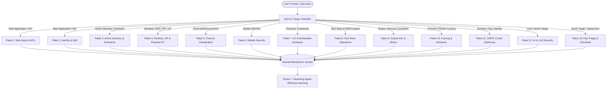

# End-to-End Penetration Testing & Multi-Domain Routing Workflow

This document outlines the standard **8-Phase Penetration Testing Lifecycle** implemented in DMLab CEH, maximizing the orchestration of all **58 offensive security skills across 13 specialized domains** and integrated OSINT engines ([Prism CLI](../tools/prism) and [SpiderFoot](../tools/spiderfoot)).

All Python commands and tools must execute inside the project's local virtual environment (`.venv`).

---

## 🧭 Multi-Domain Intent Routing Engine (13 Skill Packages)

When a user provides instructions (e.g., `"pentest https://target.com"`, `"audit AWS environment"`, `"assess AD domain"`, `"test BLE lock"`, `"fuzz network binary"`), the **Commander Orchestrator** parses the target intent and builds an execution DAG mapping to the 13 Skill Packages:



---

## 8-Phase Lifecycle & Skill Domain Integration

### Phase 0 — Scope & Blackboard Setup
| Action | Skill / Tool | Description & Output |
|---|---|---|
| Define target scope, boundaries, and exclusions | Manual / Commander | Record target scope in `results/engagement.json` |
| Initialize blackboard structure | Filesystem | Create directories: `results/{recon,findings,evidence}` |

---

### Phase 1 — Passive Reconnaissance & Intelligence Gathering
**Applicable Packages:** `Paket 11 (OSINT & Intel Gathering)`

| Target Element | Loaded Skill | Workflow / Tool Execution |
|---|---|---|
| Domain Footprint: WHOIS, DNS, crt.sh, GeoIP | `offensive-osint`, `offensive-osint-methodology` | Prism: `python tools/prism/cli.py scan <domain> --type domain --json` |
| Subdomain & Certificate Transparency | `offensive-osint-methodology` | Prism `cert_transparency` module (automated in scan) |
| Web Stack & Infrastructure Fingerprint | `offensive-osint-methodology` | Prism `website` module (headers, CMS, server tech) |
| Email & Identity Exposure | `offensive-osint` | Prism: `python tools/prism/cli.py scan <email> --type email --json` |
| Deep Correlation Footprint | `offensive-osint-methodology` | SpiderFoot: `python tools/spiderfoot/sf.py -s <target> -u all -o json` |
| Historical Endpoints & Wayback Snapshots | `offensive-osint` | Prism `wayback` module |
| Threat Intelligence & Reputation | `offensive-osint` | Prism: `shodan`, `virustotal`, `abuseipdb`, `censys` |

**Artifact Output:** `results/recon/<target>.json`

---

### Phase 2 — Fast Triage & Quick-Win Discovery
**Applicable Packages:** `Paket 13 (Fast Triage Utilities)`

| Audit Vector | Loaded Skill | Execution Technique |
|---|---|---|
| Quick-Win Checklist: Default creds, exposed backups, robots.txt, header misconfigurations | `offensive-fast-checking` | Automated inspection of recon data and exposed endpoints |
| Open Redirect Checks | `offensive-open-redirect` | Parameter review on identified redirect parameters |
| Parameter Pollution Baseline | `offensive-parameter-pollution` | Review duplicated parameters across query/body |

**Artifact Output:** `results/findings/fast-triage.json`

---

### Phase 3 — Attack Surface Mapping & Targeted Assessment
**Applicable Packages:** `Paket 1 (Web & APIs)`, `Paket 10 (Fuzzing)`, `Paket 12 (AI Security)`

| Discovered Surface | Dispatched Agent & Skill | Focus Areas |
|---|---|---|
| User Input Parameters | `sqli-agent` (`offensive-sqli`, `offensive-waf-bypass`) | Error-based, UNION, Blind, Time-based, JSON injection |
| Dynamic Reflection Points | `xss-agent` (`offensive-xss`, `offensive-waf-bypass`) | Stored, Reflected, DOM XSS, Context-specific payloads |
| Webhook / URL Fetching | `ssrf-agent` (`offensive-ssrf`, `offensive-open-redirect`) | Internal service access, Cloud metadata (IMDSv1/v2) |
| Template Engines | `ssti-agent` (`offensive-ssti`) | Jinja2, Twig, Freemarker, Velocity code execution |
| XML Parsing Endpoints | `xxe-agent` (`offensive-xxe`) | External entity injection, Out-of-band extraction |
| File Upload Handlers | `file-upload-agent` (`offensive-file-upload`) | Extension bypass, MIME spoofing, Polyglots, Webshells |
| Complex State Workflows | `web-agent` (`offensive-business-logic`, `offensive-race-condition`) | Logic boundaries, Race conditions, Price manipulation |
| Native Parsers & Protocol Endpoints | `fuzzing-agent` (`offensive-fuzzing`, `offensive-vuln-classes`) | Protocol mutation, memory bug identification, crash triage |
| LLM & GenAI Interfaces | `ai-agent` (`offensive-ai-security`) | Direct/Indirect prompt injection, jailbreaking, RAG poisoning |

---

### Phase 4 — Identity, Authentication & API Auditing
**Applicable Packages:** `Paket 2 (Identity & IAM)`, `Paket 1 (GraphQL & Smuggling)`

| Surface | Loaded Skill | Audit Objectives |
|---|---|---|
| JWT Implementations | `offensive-jwt` | `alg:none`, Key confusion (RS256→HS256), `kid` injection |
| OAuth 2.0 / OIDC | `offensive-oauth` | Redirect URI manipulation, State fixation, Token theft |
| Multi-Tenant / Object ID | `offensive-idor` | Horizontal/vertical privilege escalation across entities |
| GraphQL Endpoints | `offensive-graphql` | Introspection leakage, Batching attacks, Deep nesting DoS |
| HTTP Smuggling | `offensive-request-smuggling` | CL.TE / TE.CL desynchronization, Request hijacking |

---

### Phase 5 — Safe Exploitation Verification & Impact Proof
**Applicable Packages:** `Paket 9 (Exploit Development & Binary Exploitation)`

```
1. Craft safe, non-destructive demonstration payload (e.g., SELECT user(), read harmless file).
2. Validate WAF bypass requirements via `offensive-waf-bypass`.
3. Capture exact HTTP request/response payloads with full headers.
4. Record UTC timestamps, CVSS v3.1 / v4.0 scoring, and remediation requirements to blackboard.
```

---

### Phase 6 — Post-Exploitation & Domain-Specific Infrastructure Assessment
**Applicable Packages:** `Paket 3 (Active Directory)`, `Paket 4 (Wireless & RF)`, `Paket 5 (Cloud)`, `Paket 6 (Mobile)`, `Paket 7 (IoT)`, `Paket 8 (Red Team Operations)`

| In-Scope Infrastructure | Specialist Agent & Loaded Skills | Key Assessment Vectors |
|---|---|---|
| **Active Directory / Hybrid** | `ad-agent` (`offensive-active-directory`) | Kerberoasting, ASREPRoasting, ADCS abuse (ESC1-15), ACL abuse, DCSync |
| **Cloud (AWS, Azure, GCP)** | `cloud-agent` (`offensive-cloud`) | IAM privilege escalation, IMDSv2 token theft, Storage exfiltration, S3/Blob |
| **Wireless (802.11 Wi-Fi)** | `wireless-agent` (`offensive-wifi`, `offensive-wpa2-psk`, `offensive-wpa3-sae`, `offensive-wpa-enterprise`, `offensive-wps`, `offensive-evil-twin`, `offensive-krack-fragattacks`, `offensive-deauth-disassoc`) | Handshake capture, PMKID, WPA3 downgrade, Rogue APs, 802.1X EAP cracking |
| **Bluetooth & IoT Mesh** | `wireless-agent` (`offensive-bluetooth-ble`, `offensive-bluetooth-classic`, `offensive-zigbee-thread-matter`, `offensive-z-wave`, `offensive-lorawan-sub-ghz`) | BLE GATT enumeration, Zigbee KillerBee sniffing, Z-Wave S0 flaw, LoRaWAN replay |
| **Mobile (Android/iOS)** | `mobile-agent` (`offensive-mobile`) | Static APK/IPA analysis, Frida hooking, SSL Pinning bypass, Intent/IPC abuse |
| **IoT & Embedded Hardware** | `iot-agent` (`offensive-iot`) | Hardware UART/JTAG probing, SPI flash dump, binwalk firmware analysis, RTOS triage |
| **Red Team & Living-off-the-Land** | `redteam-agent` (`offensive-initial-access`, `offensive-advanced-redteam`, `offensive-edr-evasion`, `offensive-shellcode`, `offensive-windows-boundaries`, `offensive-windows-mitigations`) | AMSI/ETW patching, unhooking, position-independent shellcode, C2 evasion |

---

### Phase 7 — Audit Reporting & Deliverable Synthesis
**Applicable Packages:** `Paket 13 (Reporting & Deliverable Utilities)`

```bash
# Invoked via Reporting Agent with skill offensive-reporting
# Generates report formatted as report/<type>_<target>_<yyyymmdd>_<hhmm>.md
```

Deliverable Requirements:
1. **Executive Summary**: Business risk narrative tailored for C-level leadership (90-second read).
2. **CVSS v3.1 / v4.0 Scoring**: Standard vector string with per-metric justification.
3. **Reproducible Proof of Concept**: Step-by-step copy-paste ready reproduction.
4. **3-Tier Remediation Plan**: Bug fix code, Defense-in-depth WAF/filter, and SIEM detection query.
5. **Retest Verification Matrix**: Exact testing verification notes for each finding.
